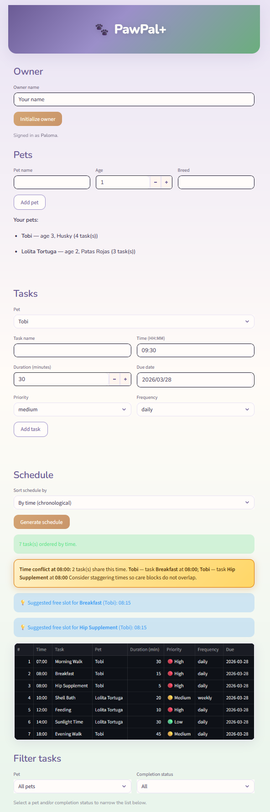

# 🐾 PawPal+

**PawPal+** is a smart pet care scheduling app built with Python and Streamlit. It helps busy pet owners stay consistent with their pets' daily routines by organizing care tasks, detecting scheduling conflicts, and generating a prioritized daily plan.

---

## 📋 Scenario

A busy pet owner needs help staying consistent with pet care. They want an assistant that can:

- Track pet care tasks (walks, feeding, meds, enrichment, grooming, etc.)
- Consider constraints (time available, priority, owner preferences)
- Produce a daily plan and explain why it chose that plan

---

## ✨ Features

- **Time-based sorting** — Tasks are ordered chronologically by their scheduled `HH:MM` time, so your day reads top to bottom in the right order.
- **Priority tie-breaking** — When two tasks share the same start time, high priority tasks appear first (high → medium → low).
- **Conflict warnings** — The scheduler flags any tasks scheduled at the exact same time and shows a warning with pet name, task name, and a suggestion to stagger care.
- **Daily and weekly recurrence** — Daily tasks auto-reschedule for tomorrow; weekly tasks reschedule 7 days out. Once tasks do not recur. Rescheduled tasks always start incomplete.
- **Smart filtering** — Filter tasks by pet name (case-insensitive) or completion status (pending/completed), or combine both filters. Results stay sorted by time.

---

## 🏗️ System Architecture

The app follows a clean backend/frontend separation:

```
pawpal_system.py  →  the backend (Owner, Pet, Task, Scheduler classes)
app.py            →  the Streamlit UI (connects to backend via imports)
main.py           →  CLI demo script (for terminal testing)
tests/            →  automated pytest suite
```

Four core classes:
- **Owner** — holds a name and a list of Pets
- **Pet** — holds pet details and a list of Tasks
- **Task** — represents a single care activity (time, duration, priority, frequency)
- **Scheduler** — the brain: sorts, filters, detects conflicts, and generates the daily plan

See `uml_final.png` for the full class diagram.

---

## 🚀 Getting Started

### Setup

```bash
python -m venv .venv
.venv\Scripts\activate       # Windows
pip install -r requirements.txt
```

### Run the app

```bash
streamlit run app.py
```

### Run the CLI demo

```bash
python main.py
```

---

## 🧪 Testing PawPal+

```bash
python -m pytest tests/ -v
```

The test suite covers 16 behaviors including:
- Task completion and pet task management
- Chronological sorting with priority tie-breaking
- Filtering by pet name and completion status
- Recurring task rescheduling (daily, weekly, once, unknown frequency)
- Conflict detection (2 tasks, 3 tasks at same time)
- Edge cases: empty owner, pet with no tasks, rescheduled task starts incomplete

---

## 📸 Demo

<a href="demo_screenshot.png" target="_blank">

</a>


## 🚀 Optional Extensions Completed

- **Challenge 1: Next Available Slot** — When conflicts 
  are detected, the app suggests the next free time slot 
  using interval-based overlap detection.

- **Challenge 2: Data Persistence** — Pets and tasks are 
  saved to `data.json` automatically and reloaded on 
  startup. Data survives page reloads and app restarts.

- **Challenge 3: Priority-Based Scheduling** — Users can 
  switch between "By time (chronological)" and 
  "By priority, then time" sort modes.

- **Challenge 4: Professional UI** — Custom pet-care theme 
  with Nunito font, purple-green gradient header, priority 
  emojis (🔴🟡🟢), and color-coded conflict warnings.